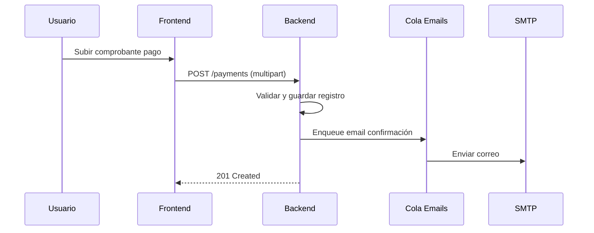
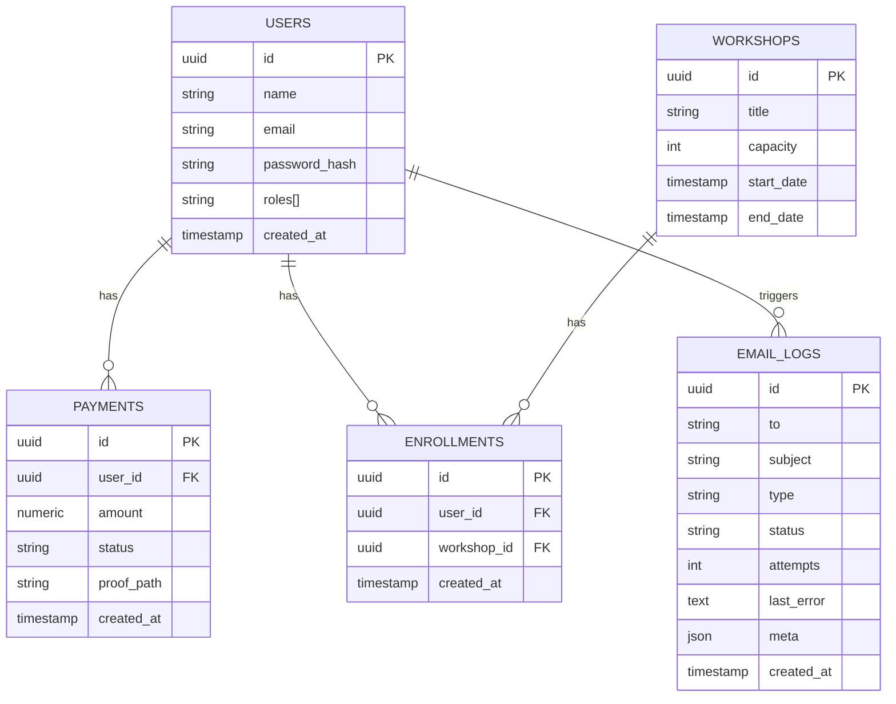

# Diagrama de Arquitectura (Alta Nivel)

```mermaid
digraph G {
  rankdir=LR;
  subgraph cluster_client {
    label="Frontend (React/Vite)";
    Browser["Navegador/SPA"];
  }
  subgraph cluster_backend {
    label="Backend (NestJS)";
    API["REST API Controllers"];
    Services["Services / Use Cases"];
    Queue["Bull Queue (emails)"];
  }
  DB[(PostgreSQL)]
  Redis[(Redis)]
  Mail["SMTP Provider"]

  Browser -> API [label="HTTPS JSON"];
  API -> Services;
  Services -> DB;
  Services -> Queue;
  Queue -> Redis;
  Queue -> Mail [label="Send email"];
}
```

# Flujo de Datos (Pago)


# Esquema Base de Datos (simplificado)

